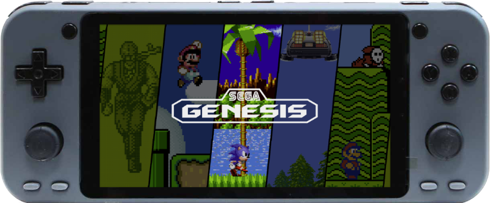

# Odroid Go Ultra

{ .off-glb }

## Overview

| Device | CPU / Architecture | Kernel | GL driver | Interface |
| -- | -- | -- | -- | -- |
| Odroid Go Ultra | Amlogic S922X / Mali G52 M6 (ARMv8-A) | Mainline Linux | Mali | Weston + Emulation Station |

## Features

| Feature&nbsp;&nbsp;&nbsp;&nbsp;&nbsp;&nbsp;&nbsp;&nbsp;&nbsp;&nbsp;&nbsp;&nbsp;&nbsp;&nbsp;&nbsp;&nbsp; | Notes |
| -- | -- |
| :material-harddisk: Storage | We recommend installing JELOS directly to the internal EMMC for faster boot and snappier performance.   When installed directly to the EMMC a microSD Card can be used for game storage.   Alternatively JELOS may also be installed to a microSD card, which will then also be used for game storage. |

## Notes

### Installation

First download the latest `S922X-Odroid_GOU` version of JELOS from the button below.

There are 2 options for installing JELOS on the Odroid Go Ultra.

#### Option 1 - Install JELOS to EMMC - RECOMMENDED
This is the recomended option as it boots faster, has snappier performance, makes the most of available storage and allows separation of the operating system (on EMMC) and game storage (on microSD).

Installation process:

1. Boot the Odroid Go Ultra into recovery mode following the steps on [the Odroid wiki](https://wiki.odroid.com/odroid_go_ultra/getting_started/installing_os_image#installation).
2. Once booted into recovery mode and connected to a PC via USB-C, the JELOS image may be flashed to the EMMC using Balena Etcher, win32diskimager, dd or similar.
3. Restart the device and JELOS will go through its first boot process (running from EMMC).

#### Option 2 - Zero-fill EMMC and install JELOS to microSD
This option has some compromises, but can come in handy if you would like to run different versions of JELOS installed to different microSD cards.

Installation process:

1. Boot the Odroid Go Ultra into recovery mode following the steps on [the Odroid wiki](https://wiki.odroid.com/odroid_go_ultra/getting_started/installing_os_image#installation).
2. Once booted into recovery mode and connected to a PC via USB-C, zero-fill the EMMC. For example using dd, `dd if=/dev/zero of=/dev/<emmc_device_node> bs=1M`.
3. Attach the microSD card to your PC using a card reader, and write the JELOS image to a microSD card using dd or similar.
4. Power off the device, insert the JELOS microSD card, power on the device and JELOS will go through its first boot process (running from microSD).

### Troubleshooting

You cannot brick this device. If you cannot get into recovery mode, do the following:

- Download [this recovery image](https://wiki.odroid.com/odroid_go_ultra/os_image/recovery).
- Follow the recovery steps on [the Odroid wiki](https://wiki.odroid.com/odroid_go_ultra/getting_started/recovery_emmc)

The device should now be in recovery mode, ready to flash JELOS (or other firmware) to the device.

## Additional References

- [Platform Documentation (S922X)](https://github.com/JustEnoughLinuxOS/distribution/blob/main/documentation/PER_DEVICE_DOCUMENTATION/S922X)
- [Odroid Go Ultra wiki](https://wiki.odroid.com/odroid_go_ultra/odroid_go_ultra)